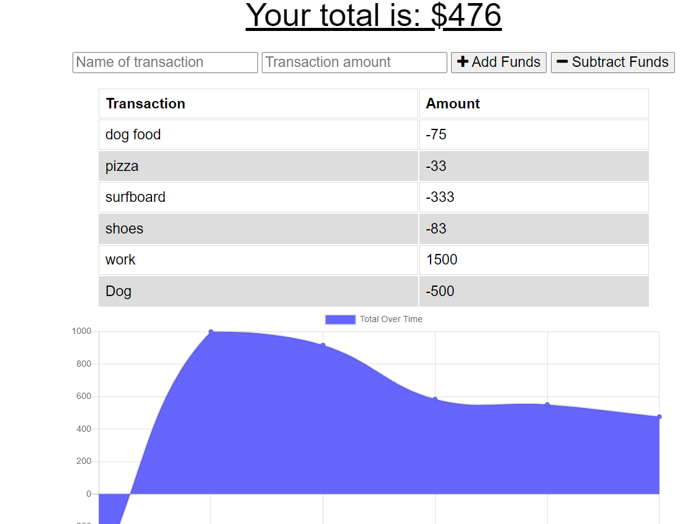

# BudgetTracker

Ever need help tracking your budget? This app was created to help me keep track off my daily expenses and so I can see it in a visual. You can add new funds that you have recieved or you can subtract funds and it will graph out the results, and hopefully its not in the red.

## License

## Installation

What are the steps required to install your project? Provide a step-by-step description of how to get the development environment running. When on consule you can NPM Start and run app!
-You can add and subtract items with titles and it will update your budget and provide a graph to help track your budget!

## ScreenShot

## Credits

What is your GitHub username? @ryansswell

What is your email? ryan0425@msn.com

What is the name of your project? Budget Tracker
